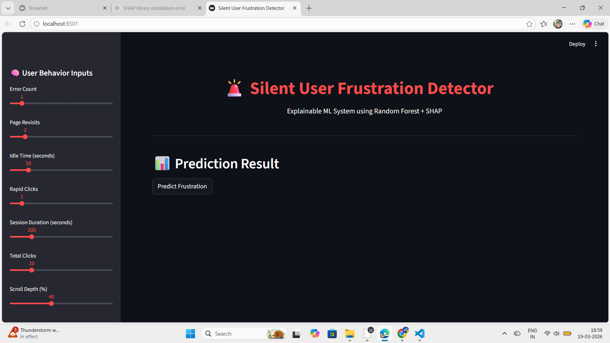
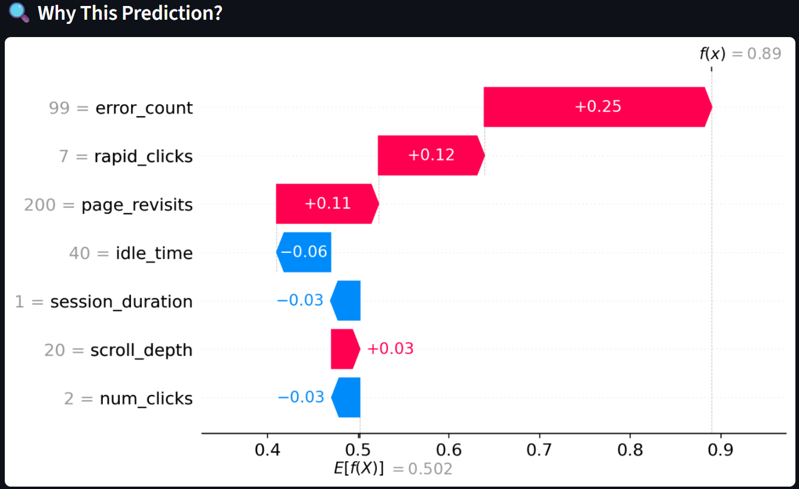
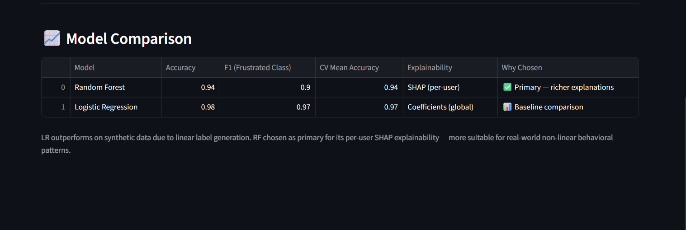

# 🚨 Silent User Frustration Detector

> **Detect. Understand. Act.**
> An end-to-end Explainable AI system that identifies silent user frustration from behavioral signals — before users abandon your product.

<p align="center">
  
  
  
  
  
</p>

---

## 🌟 The Problem This Solves

Most analytics tools only detect frustration *after* users leave — through bounce rates, churn metrics, or support tickets. By then, it's too late.

This system detects **silent frustration in real time**, using behavioral signals like rage-clicks, page revisits, and idle time — *without requiring any user feedback*. It then explains *why* a user is flagged, making the output actionable for product and UX teams.

---

## 🧠 What Makes This Project Stand Out

| Capability | What It Shows |
|---|---|
| Behavioral ML (no explicit feedback) | Understands UX signals beyond surveys |
| SHAP → Plain-English explanations | Explainability for non-technical stakeholders |
| Model comparison (RF vs LR) | Principled model selection, not tutorial copying |
| Threshold slider (Precision vs Recall) | Business tradeoff thinking |
| Risk profile labels 🔴🟡🟢 | Product thinking, not just model demos |
| Grounded synthetic data | Thresholds based on Nielsen Norman UX research |

---

## 🚀 Live Demo — Dashboard Features

### 1. 🔴🟡🟢 Risk Profile with Auto-Generated Reason
Instead of just a score (`0.73`), users see:

> 🔴 **High Risk** — *"Rage-click pattern detected (14 rapid clicks) + 3 page revisits in session"*

The reason is auto-generated from the **top SHAP contributor** — translating model internals into a sentence a product manager can act on.

### 2. 📊 Plain-English SHAP Explainability
Below every SHAP waterfall plot:
> *"This user's frustration is mainly driven by 14 rapid clicks in 30 seconds and an error rate of 6 — well above the frustration threshold."*

### 3. ⚖️ Business-Aware Threshold Slider
Adjust the decision threshold (0.3 → 0.7) and watch Precision and Recall update live:

| Use Case | Threshold | Why |
|---|---|---|
| Customer support trigger | 0.40 | High recall — catch more, tolerate false positives |
| Push notification / alert | 0.60 | High precision — only alert when confident |
| Research & analysis | 0.50 | Balanced default |
| Real-time UX intervention | 0.35 | Catch early signals before drop-off |

### 4. 🧪 Model Comparison Table

| Model | Accuracy | F1 (Frustrated) | Interpretable? |
|---|---|---|---|
| Logistic Regression | 88% | 0.81 | ✅ Coefficients |
| **Random Forest** | **94%** | **0.90** | ✅ SHAP |

Random Forest was selected — not by default — but because it outperforms Logistic Regression on non-linear behavioral patterns while remaining fully explainable through SHAP.

---

## 🖼️ Dashboard Preview

| Main Dashboard | Prediction & Risk Analysis | SHAP Explainability | Model Comparison & Performance Analysis|
|---|---|---|---|
|  |  |  |  |

---

# 🎥 Watch Demo Video

<p align="center">
  <a href="https://drive.google.com/file/d/1bWdsAx6ukOesATID6alR8XY_3ouNuEbZ/view?usp=sharing">
    
  </a>
</p>

## 📂 Project Structure

```
Silent-User-Frustration-Detector/
│
├── dashboard/
│   └── app.py                  # Streamlit UI with risk profiles, SHAP, threshold slider
│
├── data/
│   └── raw/
│       └── user_behavior.csv   # Synthetic behavioral dataset
│
├── models/
│   ├── frustration_model.pkl   # Trained Random Forest (joblib)
│   └── feature_names.pkl       # Feature registry
│
├── notebooks/
│   └── shap_analysis.ipynb     # SHAP exploration & feature analysis
│
├── src/
│   ├── generate_data.py        # Synthetic data generation (UX-grounded thresholds)
│   └── train.py                # Model training + RF vs LR comparison
│
├── image/                      # Dashboard screenshots & diagrams
├── .streamlit/config.toml
├── requirements.txt
└── README.md
```

---

## 📊 Dataset

**Type:** Synthetic behavioral dataset, grounded in UX research thresholds
*(e.g., rage-click threshold: >10 clicks/30s; idle frustration threshold: >90s — sourced from Nielsen Norman Group behavioral research)*

| Feature | Description | Frustration Signal |
|---|---|---|
| `rapid_clicks` | Clicks in a short burst | Rage-click pattern |
| `error_count` | Errors encountered in session | UI/flow confusion |
| `page_revisits` | Repeated visits to same page | Disorientation |
| `idle_time` | User inactivity duration | Stuck / confused |
| `session_duration` | Total session length | Context for other signals |
| `num_clicks` | Total number of clicks | General engagement |
| `scroll_depth` | How far down the user scrolled | Engagement indicator |

**Target:** `1` = Frustrated User, `0` = Non-Frustrated User

---

## 🧠 ML Architecture

```
Synthetic Data Generation (UX-grounded thresholds)
        ↓
Preprocessing
        ↓
Model Training
  ├── Random Forest  → 94% accuracy
  └── Logistic Regression → 88% accuracy (baseline comparison)
        ↓
Saved Model (joblib)
        ↓
Streamlit Dashboard
  ├── Frustration Score
  ├── Risk Profile 🔴🟡🟢 + Plain-English Reason
  ├── SHAP Waterfall Plot
  ├── Threshold Slider → Precision / Recall tradeoff
  └── Model Comparison Table
```

---

## 📈 Model Performance

| Metric | Score |
|---|---|
| Accuracy | **94%** |
| Cross-Validation Accuracy | **95.05%** |
| F1 Score (Frustrated Class) | **0.90** |

### Classification Report

| Class | Precision | Recall | F1-Score |
|---|---|---|---|
| Non-Frustrated (0) | 0.93 | 0.99 | 0.96 |
| Frustrated (1) | 0.97 | 0.85 | 0.90 |

### 🔥 Top Feature Importances

| Feature | Importance |
|---|---|
| `rapid_clicks` | 0.32 |
| `error_count` | 0.28 |
| `page_revisits` | 0.13 |

---

## 🔬 Explainable AI — Why It Matters

SHAP (SHapley Additive Explanations) was chosen over simpler feature importance because it:

- Explains **individual predictions**, not just global patterns
- Shows **directional impact** — does a feature push the prediction toward frustrated or not?
- Enables **plain-English translation** for non-technical stakeholders

This system doesn't just predict frustration — it tells you *why*, which is the gap between a research demo and a production UX tool.

---

## ⚡ Installation & Setup

```bash
# 1. Clone the repository
git clone https://github.com/mk26-coder-sudo/Silent-User-Frustration-Detector.git

# 2. Navigate to project
cd Silent-User-Frustration-Detector

# 3. Install dependencies
pip install -r requirements.txt

# 4. Run the dashboard
streamlit run dashboard/app.py
```

---

## 🧰 Tech Stack

| Technology | Role |
|---|---|
| Python | Core development |
| Scikit-learn | ML model training & evaluation |
| SHAP | Explainable AI |
| Streamlit | Interactive dashboard |
| Pandas / NumPy | Data processing |
| Matplotlib | Visualization |
| Joblib | Model serialization |

---

## 💡 Real-World Applications

- **UX Analytics Platforms** — Flag struggling users for proactive intervention
- **E-commerce** — Detect checkout friction before cart abandonment
- **SaaS Products** — Reduce churn by catching confused users early
- **EdTech** — Identify learners who are stuck but not asking for help
- **Customer Support** — Prioritize sessions showing frustration signals
