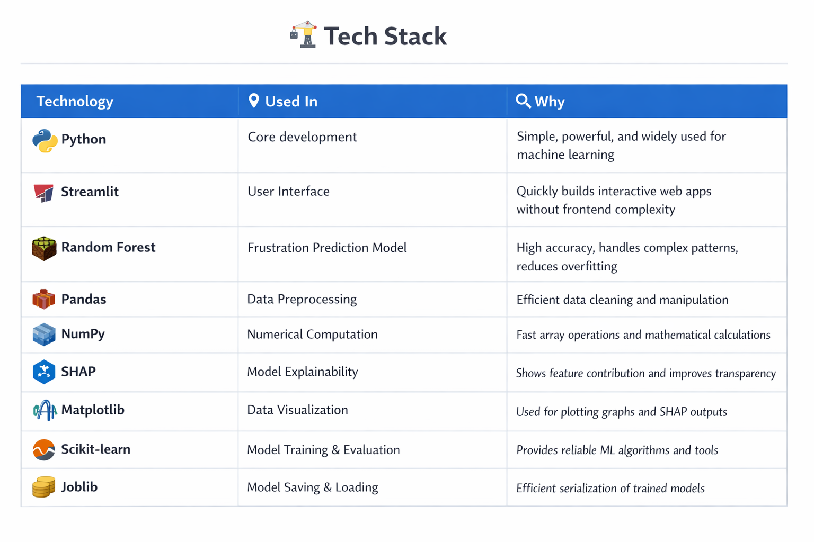
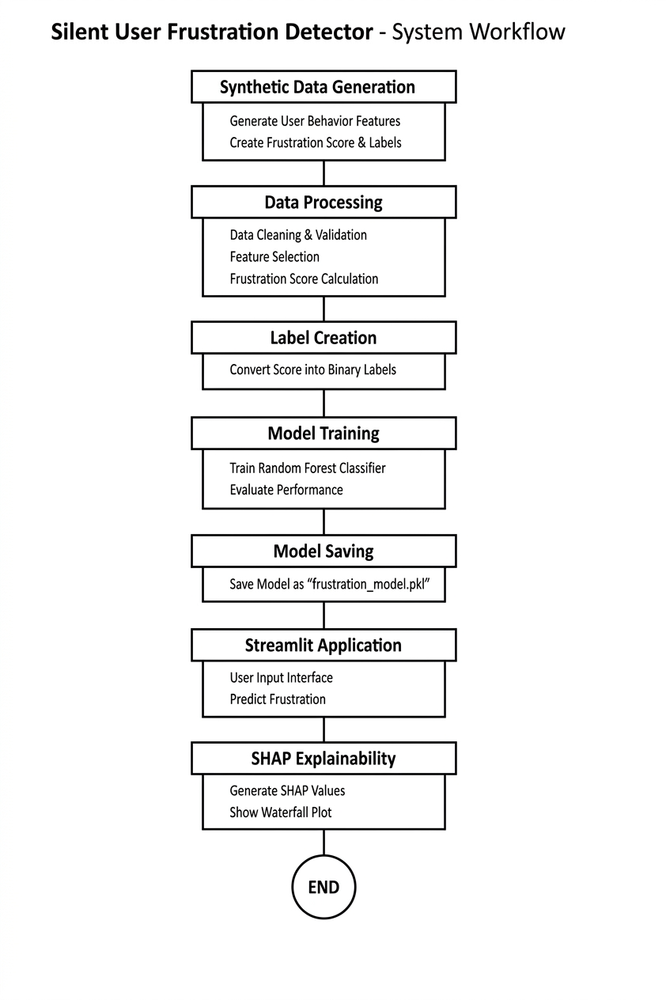
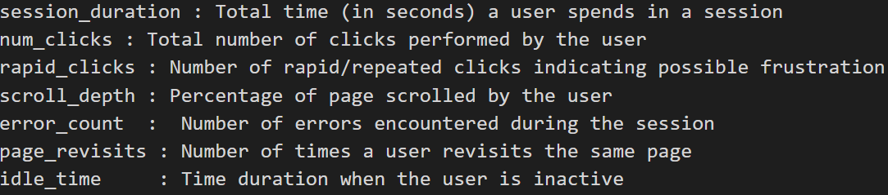
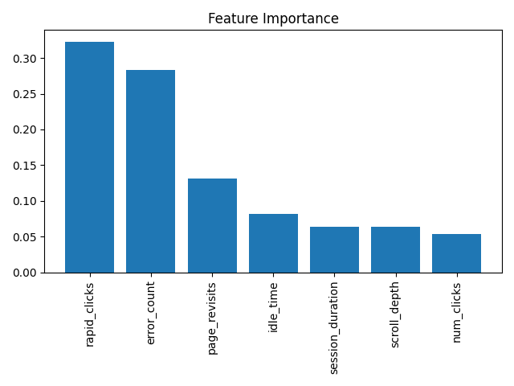

# Silent User Frustration Detector

## 🚀 Project Overview

Tech That Understands User Behavior, One Interaction at a Time.
A Streamlit-based web application that detects silent user frustration using behavioral data like:

- Repeated errors  
- Rapid clicks  
- Excessive idle time  
- Page revisits  
- Short abnormal sessions  

The system uses a machine learning model to predict frustration and provides explainable insights using SHAP to help improve user experience.

---

## 🧠 Tech Stack
## 1. Python

📍 Used in:
Core development (ML + backend logic)

🔎 Why:
Easy to use and powerful for data science
Supports all required ML libraries

## 2. Pandas

📍 Used in:
Data preprocessing and handling datasets

🔎 Why:
Efficient for data manipulation
Makes cleaning and transformation easy

## 3. NumPy

📍 Used in:
Numerical computations

🔎 Why:
Fast operations on arrays
Supports mathematical calculations

## 4. Streamlit

📍 Used in:
Building the web interface (UI)

🔎 Why:
Quickly converts ML models into interactive web apps
No frontend knowledge required

## 5. Random Forest Classifier

📍 Used in:
Predicting user frustration

🔎 Why:
Handles complex patterns well
Gives high accuracy and avoids overfitting

## 6. SHAP (SHapley Additive Explanations)

📍 Used in:
Explaining model predictions

🔎 Why:
Shows contribution of each feature
Improves model transparency

## 7. Matplotlib

📍 Used in:
Visualizing SHAP outputs and graphs

🔎 Why:
Helps in plotting graphs clearly
Useful for analysis and debugging

## 8. Scikit-learn

📍 Used in:
Training and evaluating the ML model

🔎 Why:
Provides ready-to-use ML algorithms
Easy implementation and reliable

## 9. Joblib

📍 Used in:
Saving and loading trained model

🔎 Why:
Efficient model serialization
Faster than pickle for large models


---

# Flow Diagram 


# Dataset Used 
📍 Source:

Synthetic dataset generated to simulate real-world user interaction behavior

## Description:

The dataset represents user behavioral patterns captured during interaction with a web interface.
It is designed to identify signs of silent frustration without explicit user feedback.

## Feature


## Target Variable 
frustrated    :   1 → Frustrated User, 0 → Not Frustrated

# Methodology

### Algorithm Used

The project uses a **Random Forest Classifier** for predicting user frustration.

Random Forest is an ensemble learning method that combines multiple decision trees to improve prediction accuracy and reduce overfitting.

---

###  Why Random Forest?

- Handles complex, non-linear relationships in data  
- Robust to noise and outliers  
- Provides high accuracy with minimal tuning  
- Works well with tabular behavioral data  

---

### Training Process

The model training follows these steps:

1. **Data Preparation**
   - Cleaned the dataset by handling missing values  
   - Selected relevant behavioral features  

2. **Feature Engineering**
   - Processed input features like session duration, clicks, and idle time  
   - Ensured proper scaling where required  

3. **Train-Test Split**
   - Dataset split into training and testing sets (e.g., 80:20 ratio)  

4. **Model Training**
   - Trained using Random Forest Classifier from scikit-learn  
   - Learned patterns between user behavior and frustration levels  

5. **Model Evaluation**
   - Evaluated using accuracy and cross-validation  
   - Achieved high performance (~95% accuracy)  

---

### Explainability (SHAP)

To make the model interpretable:

- SHAP (SHapley Additive Explanations) is used  
- It shows the contribution of each feature to the prediction  
- Helps understand *why* a user is classified as frustrated  

---

### Outcome

The trained model can:

- Predict whether a user is frustrated or not  
- Provide a probability score  
- Explain predictions using feature contributions  

---
# Results & Performance

## Model Performance

- Accuracy: 94%
- Cross Validation Accuracy: 95.05%

## Classification Insights

- Class 0 → Precision: 0.93 | Recall: 0.99 | F1: 0.96  
- Class 1 → Precision: 0.97 | Recall: 0.85 | F1: 0.90  

The model shows strong overall performance, with slightly lower recall for Class 1, indicating some missed positive cases.

## Key Features

- rapid_clicks (0.32)
- error_count (0.28)
- page_revisits (0.13)

Rapid clicking behavior and error frequency are the most significant indicators of user frustration.




# Dashboard


## ▶️ How to Run

```bash
git clone https://github.com/mk26-coder-sudo/Silent-User-Frustration-Detector.git
cd silent-user-frustration-detector
pip install -r requirements.txt
streamlit run app.py

